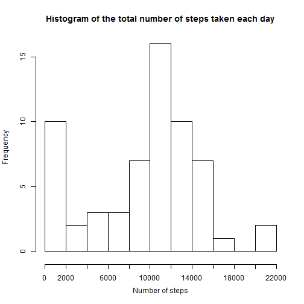
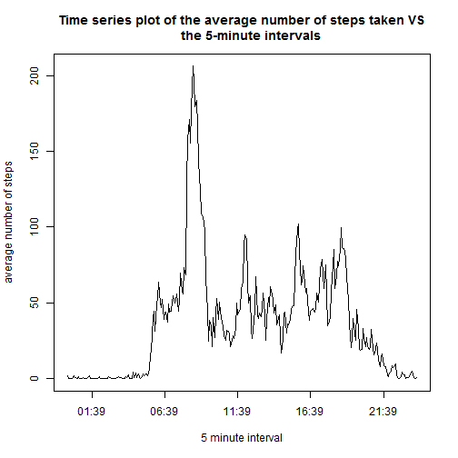
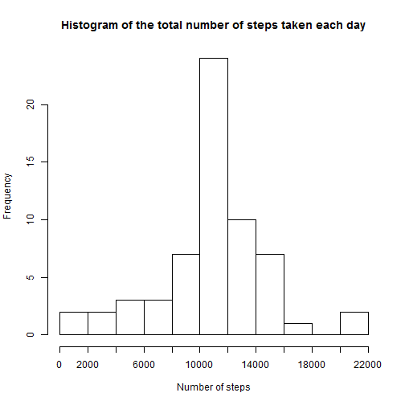
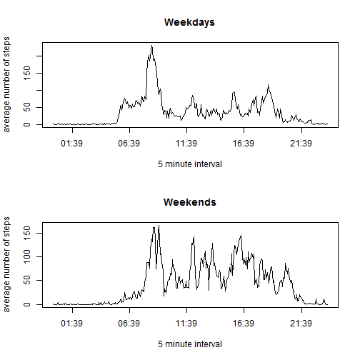

# Peer assignment 1

## Question 1: What is mean total number of steps taken per day?

At first I create function, that returns vector with total steps taken per each of
61 days.

```r
  total<-function(file){ 
   d<-as.numeric(format(as.Date(file$date),"%d"))
   m<-as.numeric(format(as.Date(file$date),"%m"))
   TotalPerDay<-vector()
   j<-1
        for (i in 1:61) {
            if (i<32) {
              t<-file[(d==i)&(m==10),]
              TotalPerDay[i]<-sum(t$steps,na.rm=TRUE)
            }
             else {
              t<-file[(d==j)&(m==11),]
              TotalPerDay[i]<-sum(t$steps,na.rm=TRUE)
              j<-j+1
             }
        }
   TotalPerDay
  }
```

Then apply this function for our data and build histogram and calculate mean and median.

```r
 download.file("http://d396qusza40orc.cloudfront.net/repdata%2Fdata%2Factivity.zip","activity.zip",mode="wb")
 unzip("activity.zip","activity.csv")
 a<-read.csv("activity.csv")  
 hist(total(a),
      right=TRUE,
      breaks=9,
      xaxt="n",
      main="Histogram of the total number of steps taken each day",
      xlab="Number of steps"
     )
 axis(1,at = seq(0,22000,2000),pos = -1)
```

 

Mean and median values:

```r
mean(total(a)) 
```

```
## [1] 9354.23
```

```r
median(total(a))
```

```
## [1] 10395
```

## Question 2: What is the average daily activity pattern?

Here I divide one day on 288 intervals (5-minute intervals). 
And create vector with average number of steps taken, averaged across all days.

```r
a<-cbind(a,1:288) #auxiliary column fot calculating aferage values
colnames(a)[4]<-"identifier"
t<-vector()
for (i in 1:288) {
  t[i]<-mean(a[a$identifier==i,]$steps,na.rm=TRUE)
}
```
There are 288 intervals (00:00 means 00:00-00:05,
                         00:05 means 00:05-00:10,
                         00:10 means 00:10-00:15, etc)

```r
timeseq<-seq(as.POSIXct("1912-02-25 00:00:00"), #auxiliary time sequance for x-axis
         as.POSIXct("1912-02-25 23:55:00"), by="5 min")
plot(timeseq,t,
     type="l",
     main="Time series plot of the average number of steps taken VS
     the 5-minute intervals",
     xlab="5 minute interval",
     ylab="average number of steps")
```

 

5-minute intervals containing the maximum and minimum number of steps **("00:00" means "00:00-00:05")**:


```r
substr(as.character(timeseq[which.max(t)]),12,16)
```

```
## [1] "08:35"
```

```r
substr(as.character(timeseq[which.min(t)]),12,16)
```

```
## [1] "00:40"
```
It's obvious. Minimum of person's activity is in the night, whereas maximum in the 
begining of the day. It also proves main time series plot.

## Imputing missing values
The total number of missing values in the dataset:

```r
sum(is.na(a))
```

```
## [1] 2304
```
Strategy: missed values in the dataset are replaced by mean for that 5-minute interval across all days.

```r
newa<-a
i<-1
for (i in 1:17568) {
  if (is.na(newa[i,1])) {
    newa[i,1]<-t[newa[i,4]]
  }
}
```
Histogram with the filled-in missing values.

```r
  hist(total(newa),
       right=TRUE,
       breaks=9,
       xaxt="n",
       main="Histogram of the total number of steps taken each day",
       xlab="Number of steps"
  )
  axis(1,at = seq(0,22000,2000),pos = -1)
```

 

Mean and median values:

```r
mean(total(newa)) 
```

```
## [1] 10766.19
```

```r
median(total(newa))
```

```
## [1] 10766.19
```
Mean and median are the same due to strategy of filling-in missing values.
These values are different from the first part of the assignment. As missed values were replaced by positive values, new mean and median were increased.

## Question 4: Are there differences in activity patterns between weekdays and weekends?

Create new facor variable "factday" which indicates whether a given date is a weekday or weekend day.

```r
p<-vector()
for (i in 1:17568) {
  if (weekdays(as.Date(newa[i,2]))==("Saturday")||
      weekdays(as.Date(newa[i,2]))==("Sunday"))
      p[i]<-"weekend"
  else
      p[i]<-"weekday"
}
factday<-factor(p, levels=c("weekday","weekend"))
newa<-cbind(newa,factday)
colnames(newa)[5]<-"day"
```
Time series plot of the 5-minute interval and the average number of steps taken.
Weekdays VS Weekend.

```r
s<-vector()
o<-vector()
  for (i in 1:288) {
    s[i]<-mean(newa[(newa$identifier==i)&(newa$day=="weekday"),]$steps)
    o[i]<-mean(newa[(newa$identifier==i)&(newa$day=="weekend"),]$steps)
  }
 par(mfrow=c(2, 1))
 plot(timeseq,s,
     type="l",
     main="Weekdays",
     xlab="5 minute interval",
     ylab="average number of steps")
 plot(timeseq,o,
     type="l",
     main="Weekends",
     xlab="5 minute interval",
     ylab="average number of steps")
```

 

There is a difference in activity patterns between weekdays and weekends. In the weekends person is more active.
